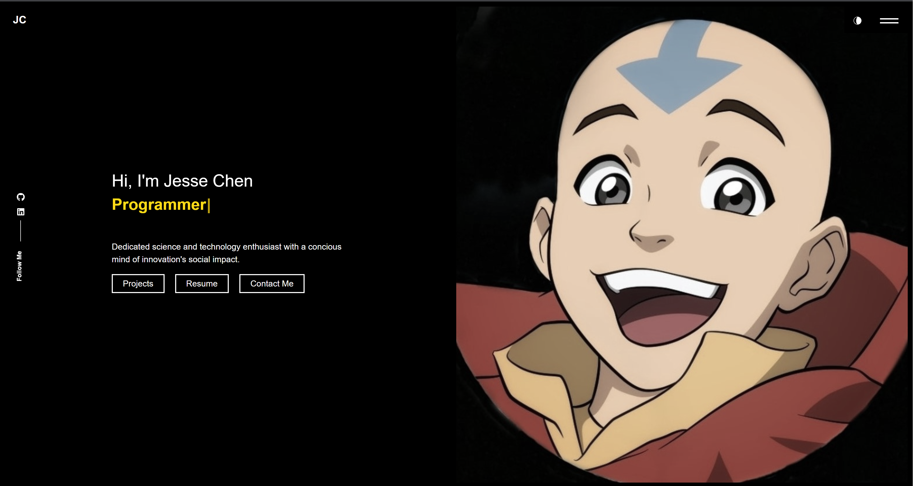

# My Portfolio

## Description

This is my personal portfolio page! It showcases the projects I have done so far in my coding journey. 

## Table of Contents

- [Installation](#installation)
- [Usage](#usage)
- [Credits](#credits)
- [License](#license)
- [How to Contribute](#how%20to%20contribute)
- [Tests](#tests)

## Installation

N/A

## Usage

You can view my porfolio via this [link](https://sparkly-haupia-f8437d.netlify.app/).

## Credits

Credit to Coding Bootcamp.
[Source code](https://github.com/ubaimutl/react-portfolio) 

## License
[MIT](https://opensource.org/licenses/MIT)

## How to Contribute

N/A

## Tests

N/A